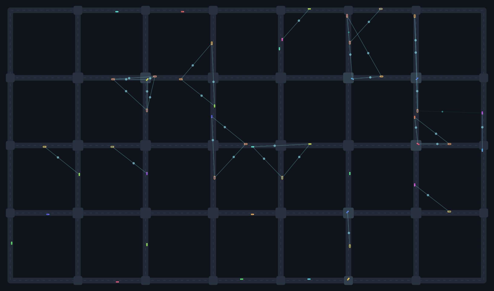

# Traffic Mesh

A browser simulation of vehicles crossing a city with **no traffic lights and no central controller**. Every car heads for its own hidden destination, broadcasts where it is and where it's going over a short-range radio, and runs the *same* rule on the messages it hears. Out of that shared rule, the intersections organize themselves.

You can run it on a tidy demo grid, or **drop it onto the real streets of any city** by name.



Each teal spark is one radio message hopping from one car to another; the brighter blue ones are cars negotiating the same intersection. Amber cars are yielding — they've worked out someone closer has the right of way. Destinations stay invisible: reach one and a car quietly picks a new one and keeps driving.

## Run it

Plain HTML/CSS/JavaScript with ES modules — no build step. Because ES modules **and** the city importer's network calls don't work over `file://`, serve the folder over HTTP:

```bash
# from the project root, any one of these:
python3 -m http.server 8000      # then open http://localhost:8000
npx serve                        # or: npm start
```

To host it for free, push the repo to GitHub and enable **GitHub Pages** (Settings → Pages → deploy from `main`). It's fully static.

## Loading a real city

Type a place into the box at the top (e.g. `Eixample, Barcelona`, `Savannah, Georgia`, or raw `lat, lon`) and hit **Load**. Under the hood the app:

1. geocodes the name with **OpenStreetMap Nominatim**,
2. downloads the drivable roads in a ~520 m radius from the **Overpass API**,
3. contracts that raw geometry into a routable network and starts the sim on it.

Both requests run **in your browser**, so a live internet connection is required and the page must be served over HTTP (not opened as a file). Real map data is messy, so the importer keeps only the largest connected chunk of road, treats mid-road shape points as gentle curves, and drops anything too sparse to drive. The **Demo grid** button always takes you back to the offline map.

## How the algorithm works

Three problems: not rear-ending the car ahead, not colliding inside an intersection, and knowing where to go. They're handled by independent layers.

### 1. Following the car ahead

Longitudinal motion uses the **Intelligent Driver Model (IDM)**. Each car picks an acceleration from its speed, the gap to the car ahead, and their closing speed, so it keeps a safe distance and joins queues smoothly.

### 2. Crossing an intersection with no lights

Every intersection has a **conflict box**. As a car nears one it broadcasts its intended path across that box. Each car then applies the same deterministic rule to everyone contending for the same box:

- **Priority is distance to the box** (closer wins; ties break by id). A car already inside outranks approaching cars. Because that's a strict total order, decisions never cycle — the network can't deadlock or starve anyone.
- **Two movements conflict only if their paths across the box actually cross**, tested geometrically. Opposing straights and most turns don't conflict, so they clear the intersection at the same time.
- A car enters the box only if no higher-priority *conflicting* car is contending **and** the road on the far side has room, so nobody blocks the box.

No car ever talks to a server; the coordination is entirely peer-to-peer, which is exactly what the flickering message lines are showing.

### 3. Endless hidden destinations

Each car is given a random destination and routed to it with Dijkstra over the road network. It never stops: the moment it arrives, it silently picks a new destination and the route is extended, so traffic keeps circulating. Destinations are deliberately never drawn.

### Compare against traffic lights

Flip on **traffic-light mode** to gate the same intersections with a fixed-time signal plan instead. Watch the arrivals-per-minute fall and the queues build — the decentralized mesh clears far more traffic at the same density.

## Controls

- **Cars on the map** — target number of vehicles kept driving at once.
- **Speed limit** — desired free-flow speed (km/h).
- **Show V2V messages** — the packet-hop radio visuals.
- **Traffic-light mode** — swap the mesh rule for fixed signals, to compare.

## Project layout

```
index.html          markup + controls
style.css           styling
src/
  config.js         all tunable parameters (metric: metres, seconds)
  util.js           vectors, geometry, polylines, geo-projection
  network.js        graph → routable network (grid + OSM share this)
  osm.js            OpenStreetMap geocode + Overpass import
  vehicle.js        one car: motion, intersection intent, re-routing
  simulation.js     the engine (headless-safe, no DOM)
  renderer.js       canvas drawing + packet-hop pulses
  main.js           wiring, fit-to-view, city importer
scripts/preview.mjs regenerates docs/preview.png
test/               node smoke + unit tests
```

Everything is in **metres and seconds**, so the same physics (car length, IDM gaps, speeds) apply whether you're on the demo grid or a real city.

## Tests

```bash
node test/smoke.test.js   # behaviour: no collisions, cars keep arriving, flow holds up
node test/unit.test.js    # pure: OSM parser + polyline geometry (no network needed)
```

The OSM *fetch* path is browser-only and can't run in CI, so the parser is unit-tested against synthetic Overpass JSON instead.

## License

MIT — see [LICENSE](LICENSE).
